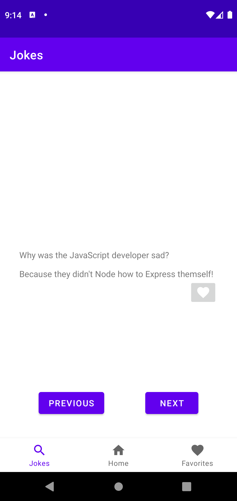
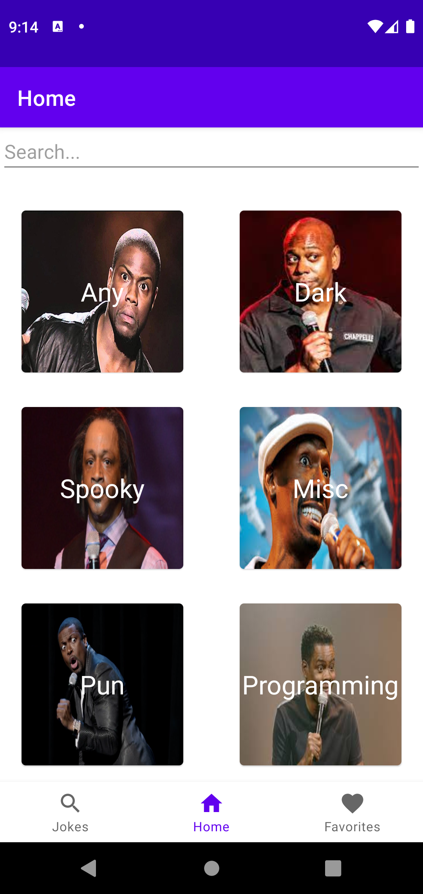
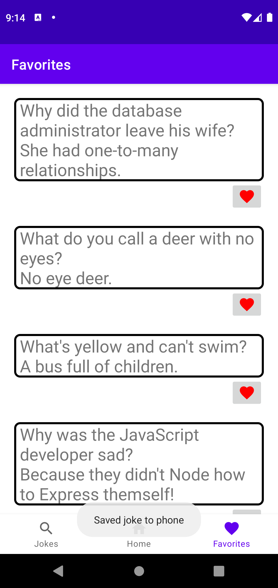

# Readme
A simple school project app utilizing API calls to fetch data from internet.

## Features
* Search for jokes with search parameters and category
* View joke with given parameters
* Go to next or previous joke
* Save jokes to local data for later viewing pleasure

## Screenshots

  

